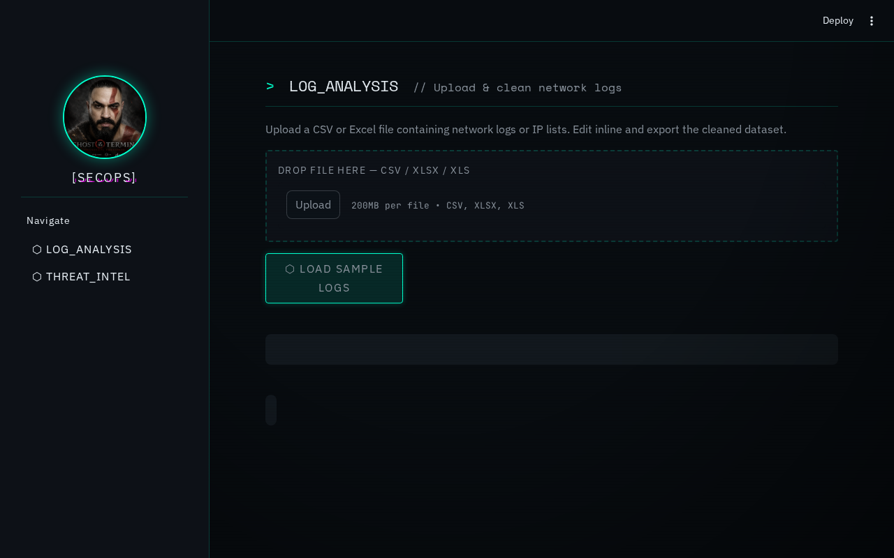
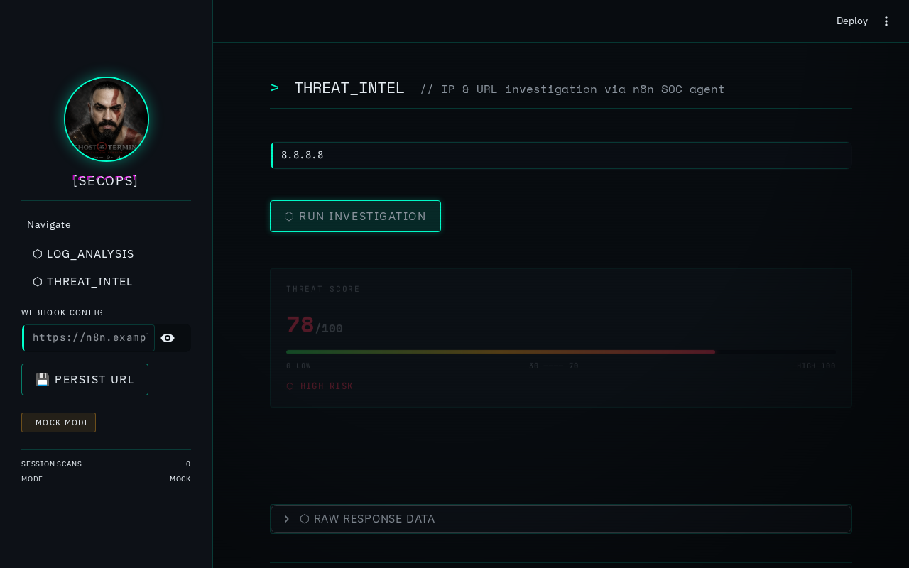

# SecOps Portal

A **Ghost-in-the-Shell-themed security operations portal** built with Python and Streamlit. Upload network logs for analysis, then investigate IPs and domains through a real n8n SOC automation pipeline — with optional AI-powered threat summaries.

> **Status:** Active development. Core features stable; n8n integration complete.





---

## Table of Contents

1. [Key Features](#key-features)
2. [Tech Stack](#tech-stack)
3. [Architecture](#architecture)
4. [Prerequisites](#prerequisites)
5. [Getting Started](#getting-started)
6. [Environment Variables](#environment-variables)
7. [Running Tests](#running-tests)
8. [n8n SOC Workflow](#n8n-soc-workflow)
9. [Deployment](#deployment)
10. [Available Commands](#available-commands)
11. [Troubleshooting](#troubleshooting)
12. [Project History](#project-history)
13. [License](#license)

---

## Key Features

| Module | What it does |
|--------|-------------|
| **LOG_ANALYSIS** | Upload CSV/XLSX network logs, edit inline, export cleaned data |
| **THREAT_INTEL** | Investigate any IP or domain via VirusTotal + ip-api.com, visualise threat scores |
| **AI Summary** | Optional LLM-powered plain-English threat assessment (BYOK — OpenAI or Ollama) |
| **MOCK MODE** | Randomised results when no webhook is configured — works offline, great for demos |
| **LIVE MODE** | Switches automatically when an n8n webhook URL is saved |

---

## Tech Stack

| Layer | Technology |
|-------|-----------|
| **Frontend** | [Streamlit](https://streamlit.io) — Python-native reactive UI |
| **Styling** | Custom CSS — Ghost in the Shell / cyberpunk terminal aesthetic |
| **Data** | [Pandas](https://pandas.pydata.org) + [openpyxl](https://openpyxl.readthedocs.io) |
| **HTTP** | [Requests](https://requests.readthedocs.io) |
| **Automation** | [n8n](https://n8n.io) (self-hosted via Docker) |
| **Threat Intel** | [VirusTotal API v3](https://developers.virustotal.com) + [ip-api.com](http://ip-api.com) |
| **AI** | OpenAI-compatible LLM (optional — swap for Ollama) |
| **Testing** | [pytest](https://pytest.org) + [pytest-mock](https://pytest-mock.readthedocs.io) |
| **Runtime** | Python 3.11+ |

---

## Architecture

### Directory structure

```
.
├── app.py                    # Streamlit entry point — all pages and UI components
├── core.py                   # Business logic: load_data, fetch_soc_data, _validate_response
├── assets/
│   └── style.css             # Ghost-in-the-Shell terminal CSS
├── n8n/
│   ├── soc_agent_workflow.json  # Importable n8n workflow (15 nodes)
│   └── README.md             # n8n setup guide
├── tests/
│   ├── conftest.py           # Fixtures + integration auto-skip logic
│   ├── test_validate_response.py  # Schema guard unit tests
│   ├── test_load_data.py     # CSV/Excel parsing unit tests
│   ├── test_fetch_soc_data.py     # Mock+live mode unit tests
│   └── test_integration_n8n.py    # Live n8n contract tests (auto-skip)
├── docker-compose.yml        # Self-hosted n8n
├── .env.example              # All environment variables documented
├── requirements.txt
└── pyproject.toml            # Pytest config + pyrefly type-checker config
```

### Data flow

```
User (browser)
    │
    ▼
Streamlit (app.py)
    │  POST {"target": "8.8.8.8"}
    ▼
n8n Webhook /soc-scan
    │
    ├─ IF IP  ──► ip-api.com (geo)  +  VirusTotal IP report
    └─ IF URL ──► VirusTotal URL report
    │
    ├─ IF OPENAI_API_KEY set ──► LLM Chain → plain-English summary
    └─ IF not set            ──► "AI disabled" message
    │
    ▼
Webhook Response
    { status, target, threat_score, location, known_malicious, summary, details }
    │
    ▼
core._validate_response()  ← type-coercion, clamping, safe defaults
    │
    ▼
Streamlit renders: threat meter + AI summary card + geo/status cards
```

### n8n workflow nodes

```
[1]  Webhook        ← receives POST from Streamlit
[2]  Set            ← sanitise target
[3]  IF             ← IP regex vs domain?
[4a] HTTP ip-api    ← geolocation (IP path)
[5a] HTTP VirusTotal IP report
[4b] HTTP VirusTotal URL report (domain path)
[6]  Merge          ← combine geo + VT
[7]  Set            ← normalise to canonical schema
[8]  IF             ← OPENAI_API_KEY feature flag
[9a] LLM Chain      ← AI summary (if key set)
[9b] Set            ← "disabled" message (if no key)
[10] Merge          ← attach summary
[11] Set            ← build final JSON
[12] Respond        ← return to Streamlit
```

---

## Prerequisites

| Tool | Version | Notes |
|------|---------|-------|
| Python | 3.11+ | Managed via `venv` |
| Docker + Compose | v2+ | For n8n only — not required for MOCK MODE |
| VirusTotal API key | — | [Free at virustotal.com](https://www.virustotal.com/gui/join-us) — 4 req/min |
| OpenAI API key | — | **Optional.** Enables AI summaries. Alternatively use Ollama (free, local). |

---

## Getting Started

### 1. Clone the repository

```bash
git clone https://github.com/sherloCod3/excel-editor-pandas-tkinter.git
cd excel-editor-pandas-tkinter
```

### 2. Create and activate a virtual environment

```bash
python -m venv venv
source venv/bin/activate        # Linux / macOS
# venv\Scripts\activate         # Windows
```

### 3. Install dependencies

```bash
pip install -r requirements.txt
```

### 4. Run the app

```bash
streamlit run app.py
```

The portal opens at **http://localhost:8501**.

At this point you are in **MOCK MODE** — all scans return randomised results. No n8n or API keys are required. This is perfect for exploring the UI and running the test suite.

### 5. (Optional) Enable LIVE MODE with n8n

See the [n8n SOC Workflow](#n8n-soc-workflow) section below.

---

## Environment Variables

Copy the example file and fill in your values:

```bash
cp .env.example .env
```

### n8n variables (used by `docker-compose.yml`)

| Variable | Required | Description | Example |
|----------|:--------:|-------------|---------|
| `N8N_USER` | ✅ | n8n UI login username | `admin` |
| `N8N_PASSWORD` | ✅ | n8n UI login password | `change_me` |
| `N8N_PORT` | — | Host port for n8n (default: `5678`) | `5678` |
| `VIRUSTOTAL_API_KEY` | ✅ | VirusTotal public API key | `abc123...` |
| `OPENAI_API_KEY` | — | Enables AI threat summaries. Leave blank to disable. | `sk-...` |
| `OPENAI_BASE_URL` | — | LLM base URL. Change for Ollama. | `https://api.openai.com/v1` |

### Streamlit webhook config

The webhook URL is saved locally via **💾 PERSIST URL** in the sidebar and written to `config.json` (gitignored). No environment variable needed.

---

## Running Tests

The test suite is split into two tiers:

### Unit tests (no external dependencies)

```bash
# Run from the project root with venv activated
pytest -m unit
```

Expected output: **36 tests, 0 failures**, ~23 seconds (mock mode has a `time.sleep(1.5)`).

```
tests/test_fetch_soc_data.py::TestMockMode::test_returns_dict          PASSED
tests/test_fetch_soc_data.py::TestLiveModeSuccess::test_calls_webhook  PASSED
tests/test_load_data.py::TestLoadCsv::test_valid_csv_returns_dataframe PASSED
tests/test_validate_response.py::TestThreatScoreCasting::test_string_score_is_cast_to_int PASSED
... (36 total)
36 passed in 22.86s
```

### Integration tests (requires n8n running)

Integration tests are **automatically skipped** when `N8N_WEBHOOK_URL` is not set.

```bash
# Start n8n first (see n8n SOC Workflow section)
docker compose up -d

# Then run with your webhook URL
N8N_WEBHOOK_URL=http://localhost:5678/webhook/soc-scan pytest -m integration -v
```

These tests verify the **contract** between Streamlit and the n8n workflow: required keys, type guarantees, score ranges, and edge cases like empty targets.

### What each test file covers

| File | Tests | What it guards |
|------|:-----:|----------------|
| `test_validate_response.py` | 16 | Type coercion, clamping, missing-field defaults |
| `test_load_data.py` | 10 | CSV/XLSX parsing, error handling |
| `test_fetch_soc_data.py` | 14 | Mock mode, mocked live mode, timeout=15s regression |
| `test_integration_n8n.py` | 10 | Live n8n response schema contract |

---

## n8n SOC Workflow

### Quick setup

```bash
# 1. Configure secrets
cp .env.example .env
# Edit .env — fill in N8N_USER, N8N_PASSWORD, VIRUSTOTAL_API_KEY
# Optionally add OPENAI_API_KEY for AI summaries

# 2. Start n8n
docker compose up -d

# 3. Open http://localhost:5678 and log in

# 4. Import the workflow
# n8n UI → + → Import from file → select n8n/soc_agent_workflow.json

# 5. Activate the workflow (toggle top-right)

# 6. Copy the Production webhook URL
# Click the Webhook node → copy URL

# 7. Paste into Streamlit sidebar → PERSIST URL
# The badge switches from MOCK MODE to LIVE MODE
```

### Using Ollama instead of OpenAI

```bash
# Install Ollama and pull a model
ollama pull llama3

# In .env:
OPENAI_API_KEY=ollama                          # any non-empty value enables the AI branch
OPENAI_BASE_URL=http://host.docker.internal:11434/v1

# Restart n8n
docker compose restart n8n
```

> On Linux, `host.docker.internal` may not resolve automatically. Add this to `docker-compose.yml` under the `n8n` service:
> ```yaml
> extra_hosts:
>   - "host.docker.internal:host-gateway"
> ```

### AI feature flag behaviour

| `OPENAI_API_KEY` | Result |
|:----------------:|--------|
| Not set / empty | AI node is **skipped**. `summary` returns "AI summary disabled…" message. No errors. |
| Set to any value | LLM Chain runs. `summary` contains a 2–3 sentence analyst assessment with a recommendation. |

Full setup documentation: [`n8n/README.md`](./n8n/README.md)

---

## Deployment

### 1. Deploying the Frontend (Streamlit App)

Streamlit Community Cloud is free and pulls directly from GitHub. It is perfect for hosting this portal.

1. **Push your code to GitHub**: Ensure all changes are committed and pushed to your public or private GitHub repository.
2. **Log into Streamlit**: Go to [share.streamlit.io](https://share.streamlit.io/) and log in with your GitHub account.
3. **Deploy the App**: 
   - Click **"New App"**.
   - Select your GitHub repository.
   - Branch: `main`
   - Main file path: `app.py`
   - Click **Deploy!**

> **Note:** Out of the box, the deployed app will work perfectly in **MOCK MODE**, making it great for portfolio demonstrations.

### 2. The n8n Backend Catch (Important)

Streamlit Community Cloud **only** runs Python scripts. It **cannot** run your `docker-compose.yml` file, which means it cannot host your self-hosted n8n instance. 

If you want the **LIVE MODE** (real threat intelligence) to work for public users, your n8n instance must be hosted somewhere accessible over the public internet.

**Options for hosting n8n:**
- **Cloud VPS (Recommended & Cheap):** Spin up a basic Linux VPS on DigitalOcean, Hetzner, or AWS EC2, clone your repo there, and run `docker compose up -d`.
- **Railway / Render:** You can deploy the n8n Docker image directly to PaaS providers.
- **n8n Cloud:** Use n8n's official managed cloud.

Once n8n is hosted on the public internet, copy its public Webhook URL to use in the portal.

### 3. Making the Webhook URL Permanent

Currently, the portal saves the webhook URL to a local `config.json` file. On Streamlit Cloud, the file system is *ephemeral*. If your app sleeps, `config.json` resets.

**To make it permanent:**
Use **Streamlit Secrets** when you are ready to permanently link your Streamlit app to your cloud-hosted n8n.

1. In your Streamlit Cloud dashboard, go to the App Settings -> **Secrets**.
2. Add your webhook URL securely:
   ```toml
   N8N_WEBHOOK_URL = "https://your-cloud-n8n.example.com/webhook/soc-scan"
   ```
3. Update `app.py`'s `load_config()` to check `st.secrets["N8N_WEBHOOK_URL"]` as a fallback.

---

## Available Commands

| Command | Description |
|---------|-------------|
| `streamlit run app.py` | Start the SecOps Portal (hot-reloads on save) |
| `pytest -m unit` | Run unit tests (no external deps required) |
| `N8N_WEBHOOK_URL=<url> pytest -m integration` | Run integration tests against live n8n |
| `pytest` | Run all tests (integration auto-skipped without URL) |
| `docker compose up -d` | Start n8n in the background |
| `docker compose down` | Stop n8n (data preserved in Docker volume) |
| `docker compose down -v` | Stop n8n and **delete all data** |
| `docker compose logs -f n8n` | Tail n8n logs |
| `pip install -r requirements.txt` | Install / update all dependencies |

---

## Troubleshooting

### Streamlit: `ModuleNotFoundError: No module named 'streamlit'`

The venv is not activated, or packages were not installed inside it.

```bash
source venv/bin/activate
pip install -r requirements.txt
streamlit run app.py
```

### Portal stuck in MOCK MODE after saving webhook URL

1. Verify n8n is running: `docker compose ps` → status should be `Up`.
2. Verify the workflow is **activated** (toggle in n8n UI top-right).
3. Confirm you saved the **Production URL** (not the Test URL).
4. Try a manual curl test:
```bash
curl -s -X POST http://localhost:5678/webhook/soc-scan \
     -H 'Content-Type: application/json' \
     -d '{"target": "8.8.8.8"}' | python -m json.tool
```

### VirusTotal returns 403 Forbidden

- Wrong or expired API key. Re-check `VIRUSTOTAL_API_KEY` in `.env`.
- Restart n8n after changing `.env`: `docker compose restart n8n`.

### AI summary always shows "AI summary disabled"

- `OPENAI_API_KEY` is empty in `.env`.
- After editing `.env`, restart n8n: `docker compose restart n8n`.
- Check the IF node condition in the n8n canvas — it checks `$env.OPENAI_API_KEY !== ''`.

### ip-api.com returns `fail` status

Expected behaviour for private/RFC-1918 addresses (`10.x.x.x`, `192.168.x.x`, `172.16.x.x`). ip-api.com only resolves public IPs. The workflow handles this gracefully — `location` will show `Unknown`.

### n8n port 5678 already in use

```bash
# Change the port in .env:
N8N_PORT=5679

# Restart
docker compose down && docker compose up -d
```

### Unit tests take ~23 seconds

Expected — `fetch_soc_data` in mock mode calls `time.sleep(1.5)` to simulate a real scan. The 10 mock-mode test iterations account for most of the time.

---

## Project History

This project started as a **Tkinter desktop app** (`legacy/Sistema_Pandas.py`) for non-technical users who needed Excel joins and pivots without writing formulas. The core data-manipulation logic was solid but the UI was limited.

It was rebuilt as a **Streamlit web app** with a SecOps theme — making it a more interesting portfolio piece by adding real security operations context: log analysis, threat intelligence, and an n8n automation backend.

The legacy Tkinter version is preserved in `legacy/` for reference.

---

## License

MIT — see [LICENSE](./LICENSE).
